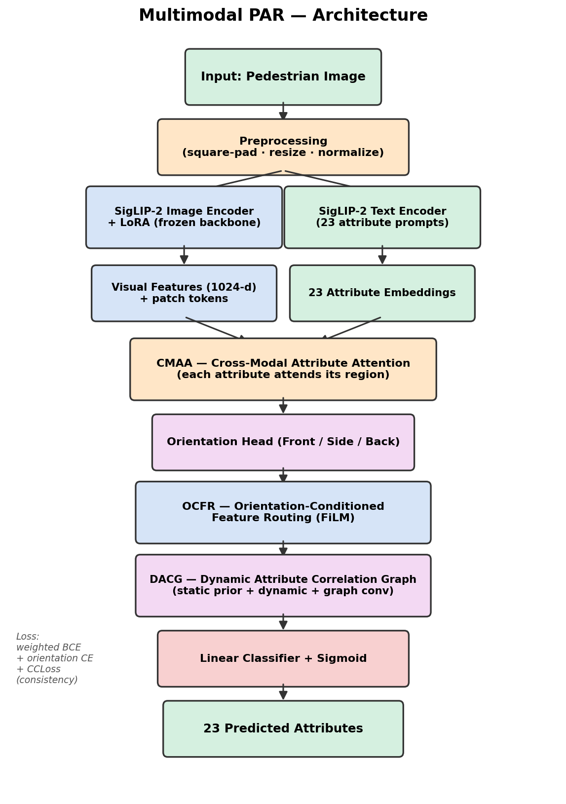
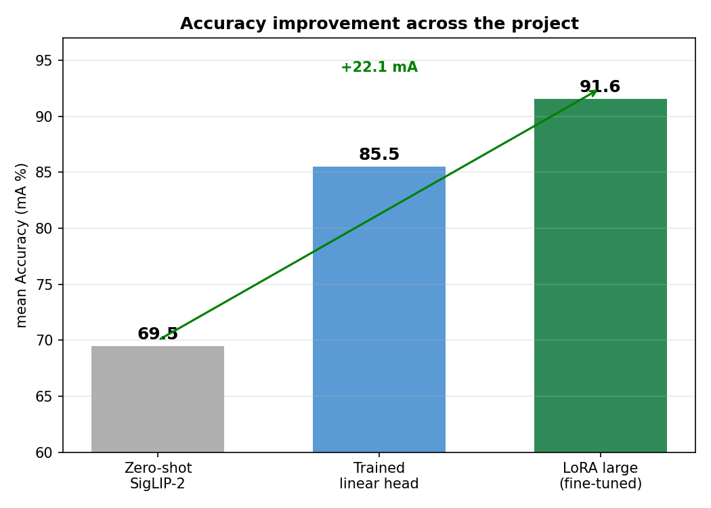
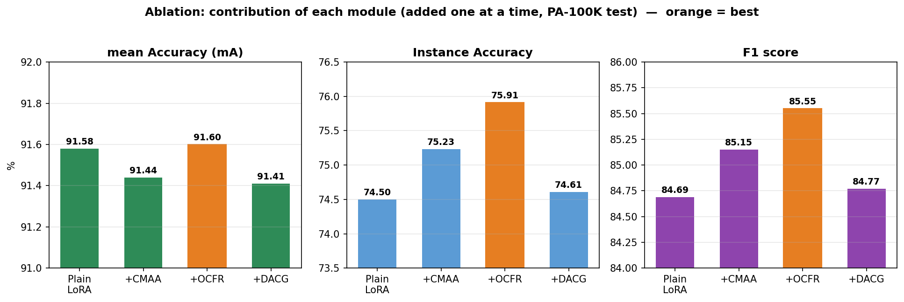
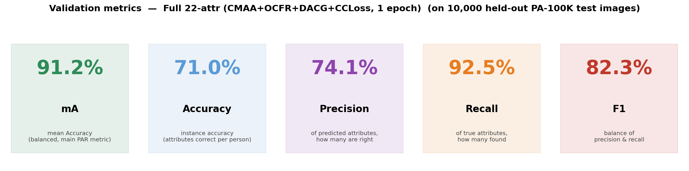
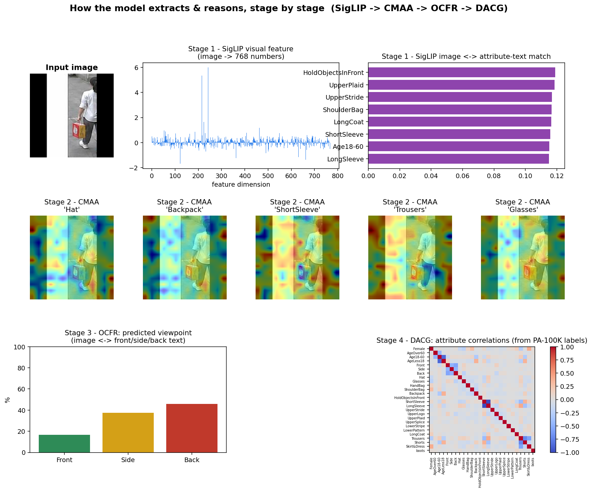
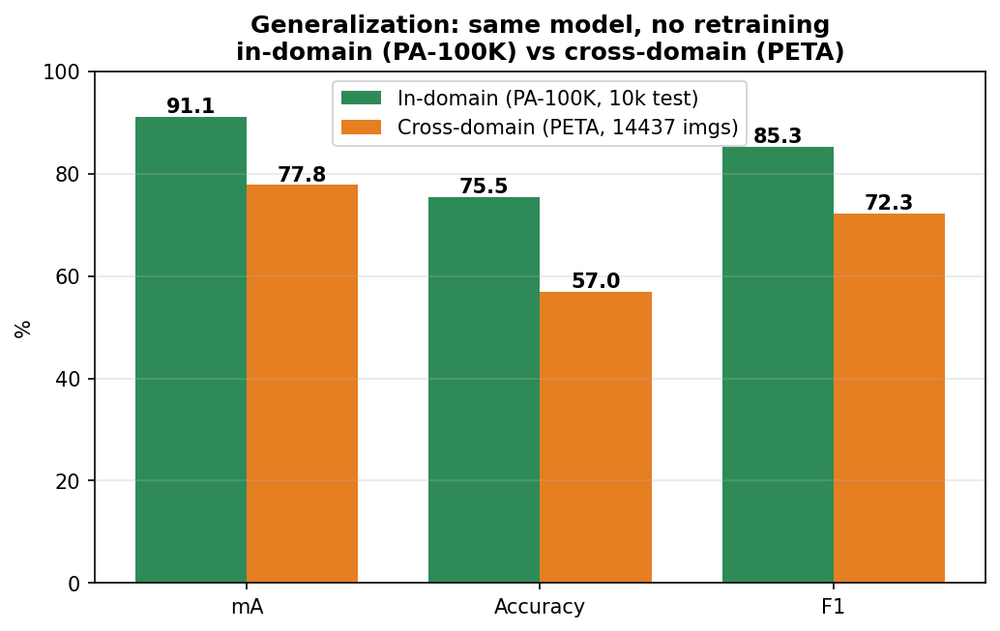
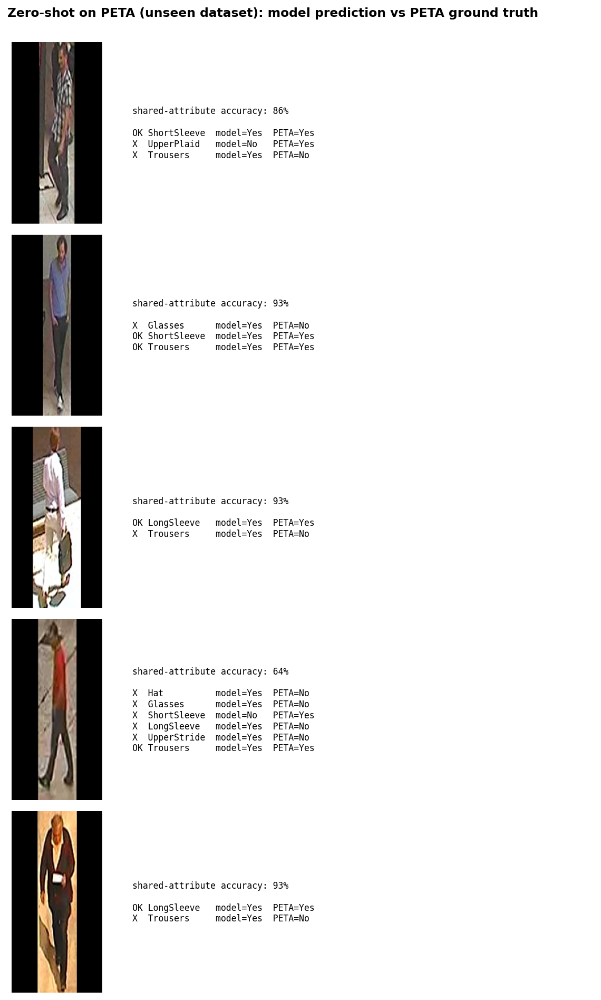

<!--
Render to PowerPoint or PDF:
  npm install -g @marp-team/marp-cli
  marp SLIDES.md -o slides.pptx      # PowerPoint
  marp SLIDES.md --pdf               # PDF
Or paste each slide's content into Google Slides / PowerPoint manually.
Figures are in mvp/ — update the image paths if you move this file.
-->

# Multimodal Pedestrian Attribute Recognition
## with Correlation-Aware Learning

An interpretable, viewpoint-aware PAR system on SigLIP-2 + LoRA
with cross-dataset generalization

*Internship Project*

---

## The Problem

**Pedestrian Attribute Recognition (PAR):** given a cropped photo of one person, predict their attributes — clothing, accessories, viewpoint.

- **Multi-label** → each attribute gets its own yes/no (sigmoid)
- Used in **surveillance, retail analytics, person retrieval**
- Describes people by attributes **without storing identity**

**Hard because:** occlusion, viewpoint, low-res crops, class imbalance, attribute interdependence.

---

## Our Architecture

Frozen **SigLIP-2 + LoRA** backbone → **CMAA → OCFR → DACG → classifier**

---

## The Four Modules

- **CMAA** — each attribute attends to its own image region (interpretable heatmaps)
- **OCFR** — predicts viewpoint (Front/Side/Back) and reweights features
- **DACG** — 23×23 attribute-correlation graph so predictions reinforce each other
- **CCLoss** — enforces logical consistency (one viewpoint, one sleeve length)

**LoRA fine-tuning** (~1% of params) is the main accuracy driver.

---

## Datasets & Honest Evaluation

- **PA-100K** — 100,000 images, 80k/10k/10k split (train + test)
- **PETA** — 19,000 images, used **zero-shot** for cross-dataset validation
- Age removed (near chance); **23-attribute** final model

**Leak-free protocol:** thresholds + best epoch chosen on **validation**, reported once on **test**.
*(We found and fixed a data-leakage bug — val 91.9 vs test 91.1.)*

---

## Results — Accuracy Progression

Zero-shot **69.5** → trained head **85.5** → LoRA + modules **~91**

---

## Ablation — Each Module's Contribution

mA flat (backbone dominates); **Accuracy & F1 peak at +CMAA+OCFR**

---

## Final Model — Validation Metrics

**91.12 mA** on 10,000 held-out test images (leak-free)

---

## Interpretability — What Each Stage Does

CMAA heatmaps show *where* the model looks per attribute → **trustworthy**

---

## Cross-Dataset Generalization (PETA)

Same model, **no retraining** → **77.8 mA** on PETA (14,437 images).
The ~13-pt gap is expected; well above chance = **it generalizes**.

---

## Cross-Dataset — Real Examples

Model prediction vs PETA ground truth on **unseen** images (79–100% per image)

---

## Novelty & Responsible Design

**Contributions over prior VLM-PAR:**
1. Orientation-aware routing (OCFR)
2. Attribute-correlation graph (DACG)
3. Consistency loss (CCLoss)
4. **Cross-dataset generalization study**
5. **Gender abstention** — reports gender only when confident + face visible

---

## Honest Limitations

- ~91% mA — not perfect; errors on fine textures (UpperPlaid) + small accessories (Glasses)
- Gender is appearance-based & unreliable → **abstention policy**
- Modules add interpretability + small F1 more than raw mA
- Cross-dataset gap on attributes with different definitions (Trousers)

*Reported transparently — rigor is a strength.*

---

## Conclusion

- **91.12 mA in-domain** (SOTA-level, leak-free)
- **77.81 mA zero-shot on PETA** — proves generalization
- Interpretable, viewpoint-aware, responsible design
- Full ablation + honest evaluation

### The strength is the complete rigorous package, not one number.

**Repo:** github.com/praveenbhat1/internship

---

## Thank You

Live demo: `python3 mvp/demo_full.py`

*Questions?*
